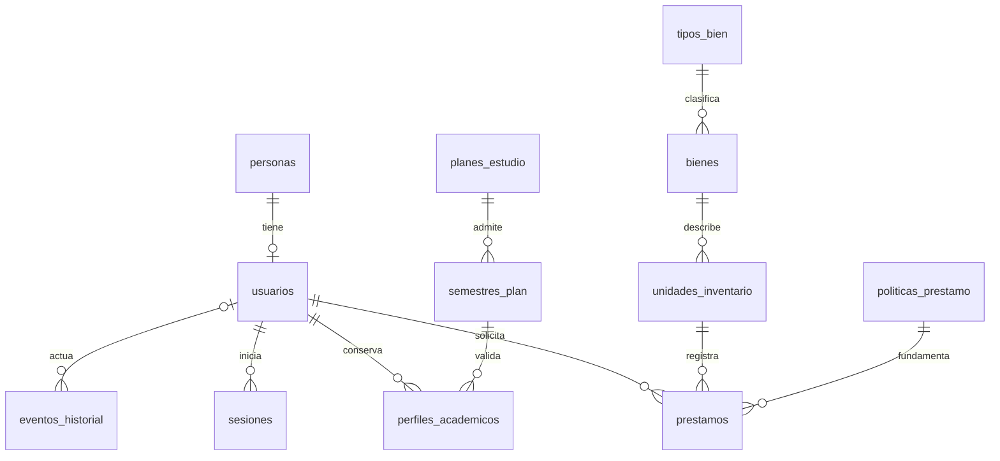

# Modelo de datos PostgreSQL

Esquema de aplicación: `prestamos`. La tabla técnica `public.pgmigrations`
registra las versiones aplicadas y la administra **node-pg-migrate**.

## Tablas

| Tabla | Responsabilidad |
| --- | --- |
| personas | Documento único, identidad, contacto y desactivación |
| usuarios | Una cuenta por persona, rol base y atribución administrativa documentada |
| perfiles_academicos | Perfil estudiante/docente, código por tipo y habilitación |
| planes_estudio | Programa y plan, cargados con información aprobada |
| semestres_plan | Semestres admitidos por plan |
| sesiones | Hash del token, expiración y revocación |
| tipos_bien | Cinco categorías permitidas |
| bienes | Ficha de catálogo, no unidad prestable |
| unidades_inventario | Código, custodia, identidad física, condición y estado |
| politicas_prestamo | Versión general o por rol, aprobación, vigencia y reglas |
| prestamos | Una unidad, responsable, entrega, devolución, inspección/destino y condiciones históricas |
| eventos_historial | Registro append-only de cambios, actor y resultado |

Además del solicitante, cada préstamo referencia al autorizante y, cuando se
devuelve, al receptor. Esas referencias no se eliminan en cascada.

## Decisiones importantes

1. Claves `bigint GENERATED ALWAYS AS IDENTITY`. `pg` devuelve `bigint` como
   cadenas para evitar pérdida de precisión; conservarlas así en la API.
2. Instantes `timestamptz`, conexiones de API en UTC y presentación futura en
   `America/Lima`. Las políticas usan horas o días de 24 horas, no días hábiles.
3. `activo`/baja lógica conserva relaciones. Estudiantes no reciben atribución
   administrativa. La aprobación institucional no se presume por crear una cuenta.
4. Un perfil anterior puede conservarse; solo el tipo coincidente con el rol actual
   habilita préstamos. Un semestre se valida con FK al plan, no con un rango 1–12.
5. Códigos/documentos sin espacios externos y unicidad sin distinguir mayúsculas
   donde corresponde. ISBN puede repetirse. Marca-modelo-serie es único cuando
   hay serie; identidad física copiada a la unidad y conservada frente a cambios
   descriptivos del catálogo.
6. `rol IS NULL` identifica política general. La política de rol tiene prioridad.
   Solo las aprobadas bloquean vigencias superpuestas. Versiones aprobadas no
   cambian sus condiciones; solo se puede acortar su fin a una fecha futura.
7. No existen políticas de solicitante para personal administrativo. El trigger
   conserva las políticas y valores efectivos del préstamo al entregar.
8. Una unidad admite como máximo un préstamo `abierto`, aunque esté vencido.
   El cupo cuenta todos los abiertos y se protege con bloqueo del solicitante.
9. `estado_cierre` separa cierre de vencimiento. La vista `v_prestamos_estado`
   devuelve activo/vencido/devuelto según el reloj, sin tareas manuales.
10. `v_disponibilidad_actual` no muestra titulares; no calcula disponibilidad de
    intervalos futuros. Ese cálculo se añadirá con reservas y rangos `[inicio,fin)`.
11. Las condiciones de entrega son inmutables. El primer avance no permite
    renovaciones, pérdidas ni reapertura de préstamos cerrados.
    Devolución conserva aptitud y destino físico declarado. Los nuevos cierres
    requieren ambos datos; valores históricos desconocidos se mantienen null.
    Un constraint trigger diferido comprueba que la unidad quede en ese destino.
    La función SQL de accesorios comprueba cantidades, incluidas repeticiones.
12. Políticas con garantía, renovación o tarifa distinta de cero son rechazadas
    explícitamente: no ignorar obligaciones aún no implementadas.
13. Auditoría automática en cambios de negocio. Excluye `password_hash` y no
    audita filas de sesiones para evitar registrar hashes de tokens. Autenticación
    emite eventos seguros de acceso/cierre de sesión; políticas y devoluciones
    añaden referencias y resultados específicos sin secretos.
14. Los alcances de políticas se serializan al crear/aprobar versiones y se leen
    con bloqueo compartido al entregar. Versiones consecutivas usan `[inicio,fin)`.
    Un cambio de vigencia futuro no reescribe valores de préstamos previos.
15. La vista de préstamos calcula retraso real y exceso sobre tolerancia sin tarifas
    nuevas ni cargos. No sustituye al futuro módulo de sanciones.

## Índices y pruebas

Índices sobre FKs frecuentes, inventario, catálogo por prefijo, estados abiertos,
vencimientos y actor/entidad/fecha de auditoría. GiST con `btree_gist` protege
vigencias de políticas. El índice parcial único protege las entregas.

Las pruebas ejecutan restricciones, errores y concurrencia real en PostgreSQL.
La meta de rendimiento de 1.000 unidades, 10.000 préstamos y diez sesiones
queda pendiente de medir cuando existan los endpoints de negocio.
